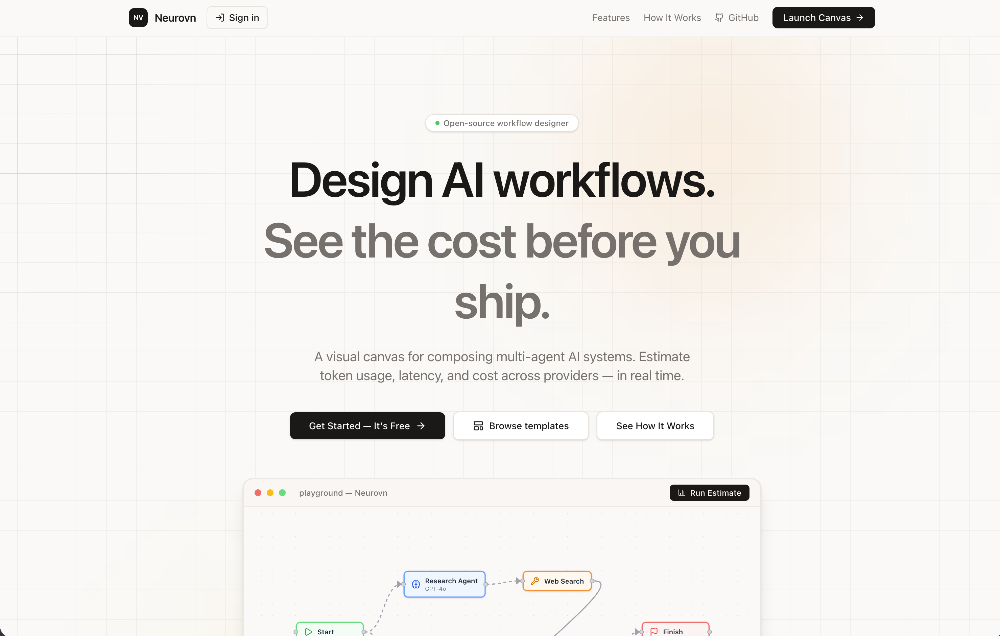
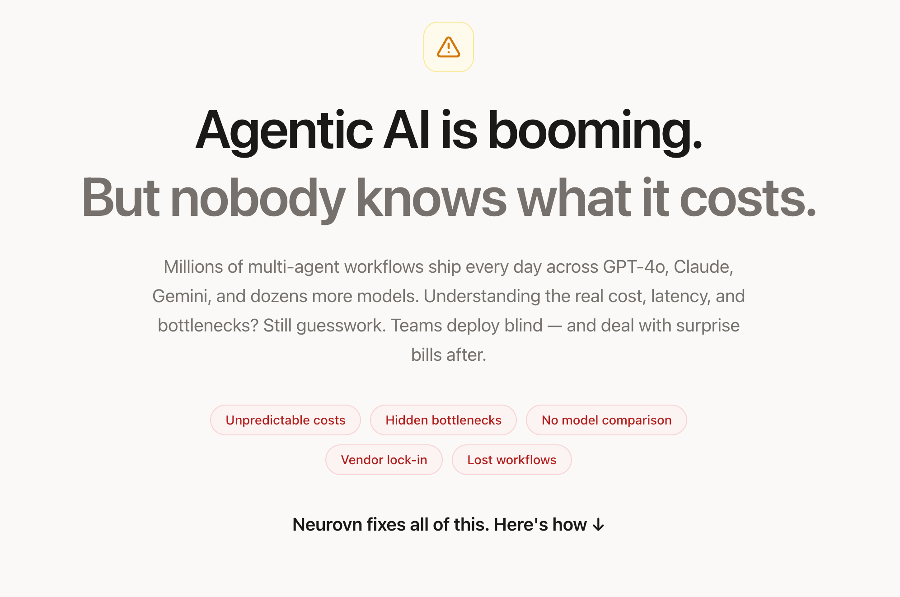
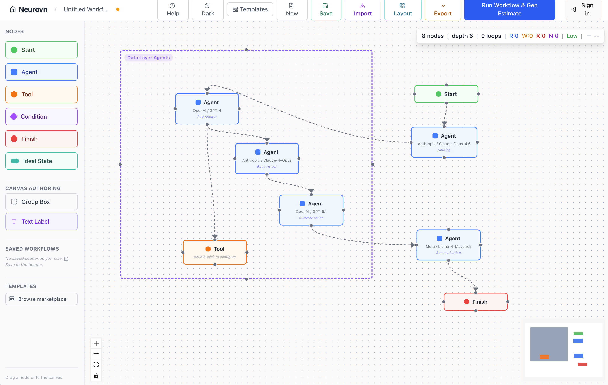
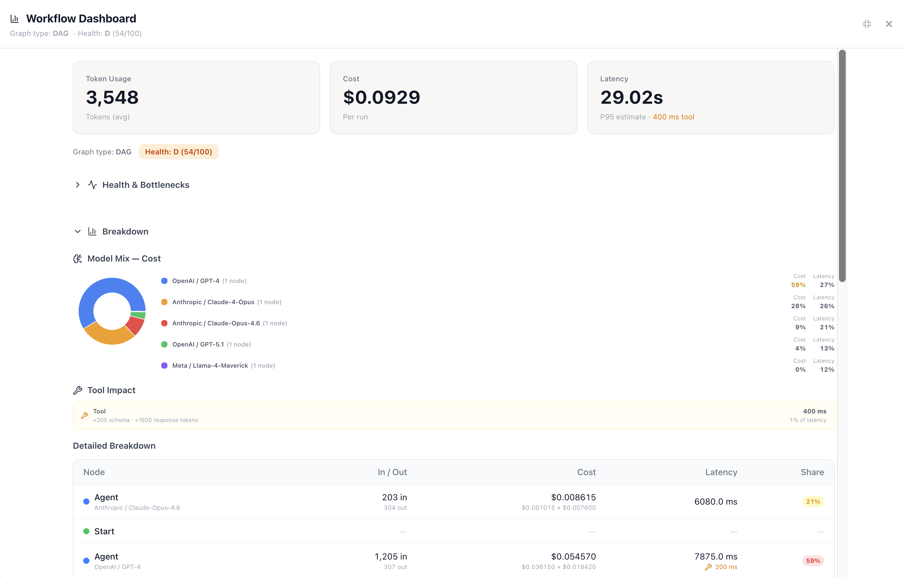
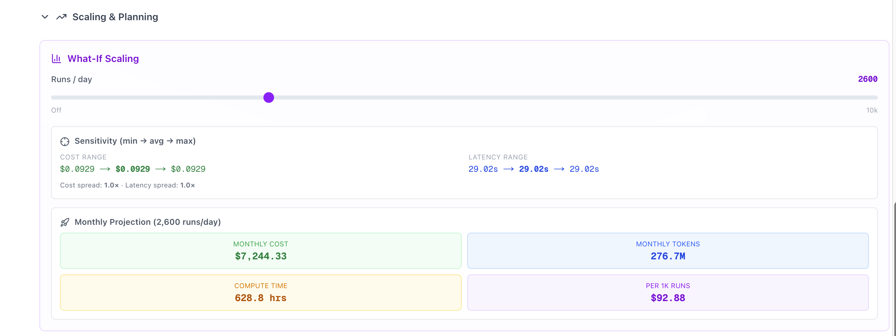
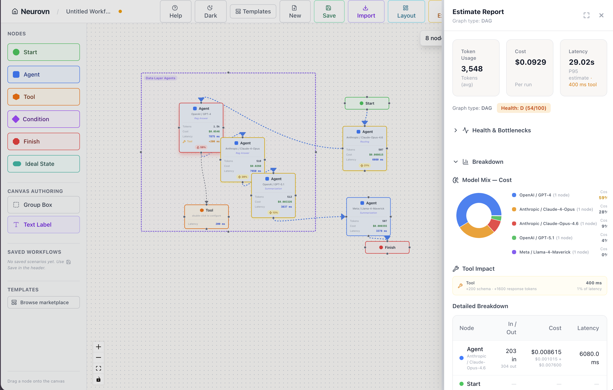

<p align="center">
  
</p>

<h1 align="center">Neurovn</h1>

<p align="center">
  <strong>The open-source cost intelligence layer for agentic AI.</strong><br/>
  Design multi-agent workflows visually. Know exactly what they'll cost — before you ship a single token.
</p>

<p align="center">
  <a href="https://neurovn.com"></a>&nbsp;
  <a href="https://github.com/RajanChavada/neurovn"></a>&nbsp;
  <a href="LICENSE"></a>
</p>

<p align="center">
  <a href="#-the-problem">Problem</a> · 
  <a href="#-the-solution">Solution</a> · 
  <a href="#%EF%B8%8F-product-walkthrough">Walkthrough</a> · 
  <a href="#-features">Features</a> · 
  <a href="#-architecture">Architecture</a> · 
  <a href="#-quick-start">Quick Start</a> · 
  <a href="#-supported-providers--models">Models</a> · 
  <a href="#-roadmap">Roadmap</a>
</p>

---

## The Problem

**Agentic AI is booming. But nobody knows what it costs.**

Millions of multi-agent workflows ship every day across GPT-4o, Claude, Gemini, and dozens more models. Teams chain LLM calls, tool invocations, and routing logic into complex graphs — but understanding the real cost, latency, and bottlenecks? Still guesswork.

The pain is real:

| Pain Point | What Happens |
|------------|-------------|
| **Unpredictable costs** | You deploy a 5-agent pipeline and get a $12K surprise bill at the end of the month |
| **Hidden bottlenecks** | One slow model in a chain of six makes the entire workflow unusable at scale |
| **No model comparison** | Swapping Claude for GPT-4o? You're flying blind on the cost/latency tradeoff |
| **Vendor lock-in** | Hard to evaluate alternatives when there's no side-by-side view |
| **Lost workflows** | Team knowledge about agent architectures lives in Slack threads and Notion docs |

<p align="center">
  
</p>

**The core issue:** There is no "Figma for AI workflows" — no visual tool where you can design a multi-agent system, see what it will cost per run, project monthly spend, and identify bottlenecks before writing a single line of code.

**Neurovn fixes all of this.**

---

## The Solution

Neurovn is a **visual canvas** — think Lucidchart meets a cost calculator — purpose-built for designing and estimating multi-agent AI systems.

You drag nodes. You connect them. You hit **Run Estimate**. In under 10 milliseconds, you get a full cost, token, and latency breakdown across every node, every model, every provider — with monthly projections and bottleneck detection.

### How it works in 30 seconds:

```
1. Drag nodes onto the canvas          → Start, Agent, Tool, Condition, Finish
2. Configure each agent                → Pick a model (GPT-4o, Claude, Gemini, etc.)
3. Connect them with edges             → Define your workflow graph
4. Hit "Run Estimate"                  → Instant cost/latency/token analysis
5. Compare, iterate, optimize          → Swap models, adjust context, find bottlenecks
```

**Zero API calls. Zero cost. Pure computation.** The estimation engine runs entirely on math — token counting via tiktoken, pricing lookups from our registry of 38+ models across 7 providers, and graph analysis (DAG detection, topological sort, critical path).

---

## Product Walkthrough

### 1. The Canvas — Your Workflow Design Surface

The heart of Neurovn is a Figma-style infinite canvas where you design AI workflows by dragging and connecting nodes.

<p align="center">
  
</p>

**What you're seeing:**
- **Left sidebar** — Drag-and-drop palette with node types (Start, Agent, Tool, Condition, Finish) plus canvas authoring tools (Group Box, Text Label)
- **Center canvas** — Infinite, pannable, zoomable workspace powered by React Flow. Nodes are connected with edges to define data/task flow
- **Header bar** — Save, Import, Export, Layout (auto-tidy), Templates, and the all-important **"Run Workflow & Gen Estimate"** button
- **Top-right stats** — Live graph metrics: node count, depth, loop count, and graph health indicators (R/W/X/N scores)

Each **Agent node** shows its model provider and model at a glance (e.g., "OpenAI / GPT-4", "Anthropic / Claude-4-Opus") along with its task type. **Tool nodes** represent external tool calls. **Condition nodes** handle routing logic. Everything is color-coded: green (Start), blue (Agent), orange (Tool), yellow (Condition), red (Finish).

The canvas supports **group boxes** for visual organization — in the screenshot you can see "Data Layer Agents" grouping multiple nodes together with a dashed border.

---

### 2. The Estimate Report — Instant Cost Intelligence

Hit **Run Estimate** and a comprehensive dashboard slides in from the right. No loading spinners. No API calls to external services. Pure computation, under 10ms.

<p align="center">
  
</p>

**The dashboard gives you:**

| Section | What It Shows |
|---------|--------------|
| **Summary Cards** | Total token usage (3,548 avg), total cost ($0.0929 per run), total latency (29.02s P95 estimate) |
| **Graph Classification** | DAG vs Cyclic detection with a health score (D: 54/100 in this example) |
| **Health & Bottlenecks** | Identifies which nodes are driving cost or latency disproportionately |
| **Model Mix — Cost** | Donut chart showing cost distribution across models. Instantly see that GPT-4 is eating 59% of your budget |
| **Tool Impact** | How much latency and token overhead each tool call adds (+200 schema tokens, +1600 response tokens, 400ms) |
| **Detailed Breakdown** | Per-node table with input/output tokens, dollar cost (split by input + output pricing), latency, and share percentage |

The **share percentage** uses color coding — nodes eating >50% of cost or latency are flagged in red, making bottlenecks impossible to miss.

---

### 3. The Estimate Report — Full Dashboard View

Open the estimate panel in full-width mode for a complete view of your workflow economics.

<p align="center">
  
</p>

**Key insights at a glance:**
- **Token Usage: 3,548** — Average tokens consumed per workflow run
- **Cost: $0.0929** — Total cost per single execution
- **Latency: 29.02s** — End-to-end P95 latency estimate including 400ms tool overhead
- **Model Mix Donut** — Visual breakdown of which models are most expensive. In this workflow, OpenAI/GPT-4 dominates at 59% of cost, while Meta/Llama-4-Maverick adds only 0% (effectively free by comparison)
- **Detailed Breakdown Table** — Every node with its exact input/output token count, cost split (input pricing + output pricing), and latency contribution

---

### 4. Scaling & Planning — What-If Analysis

The Scaling & Planning section answers the question every team asks: **"What will this cost at production scale?"**

<p align="center">
  
</p>

**What-If Scaling slider:**
- Drag the slider from 0 to 10,000 runs/day
- At 2,600 runs/day in this example:

| Metric | Projection |
|--------|-----------|
| **Monthly Cost** | $7,244.33 |
| **Monthly Tokens** | 276.7M |
| **Compute Time** | 628.8 hours |
| **Per 1K Runs** | $92.88 |

**Sensitivity Analysis** shows min → avg → max ranges for both cost and latency, with spread multipliers (1.0x means no variance — tighten your estimates with more context).

This is the slide you put in front of your CTO. "Here's what our agent pipeline will cost at scale. Here's the bottleneck. Here's what happens if we swap Model X for Model Y."

---

### 5. Side-by-Side: Canvas + Estimate

The real power emerges when you see the canvas and estimate panel together — the workflow design on the left, the cost analysis on the right.

<p align="center">
  
</p>

**The feedback loop is instant:**
1. Change a model on any agent node (double-click to configure)
2. Hit Run Estimate again
3. See the cost/latency impact in real time
4. Compare scenarios with the built-in comparison drawer

The canvas even shows **inline estimation badges** on each node after running an estimate — token counts, cost, latency, and share percentage right on the node itself. No switching between views. No mental context-switching.

---

## Features

### Core Capabilities

| Feature | Description |
|---------|-------------|
| **Visual Workflow Designer** | Infinite canvas with drag-and-drop nodes, edges, group boxes, and text labels |
| **Instant Cost Estimation** | Token, cost, and latency breakdown in <10ms — zero external API calls |
| **38+ Model Support** | OpenAI, Anthropic, Google, Meta, Mistral, DeepSeek, Cohere — all major providers |
| **Graph Intelligence** | DAG vs Cyclic detection, topological sort, critical path analysis, health scoring |
| **What-If Scaling** | Project monthly costs at any runs/day volume with sensitivity analysis |
| **Scenario Comparison** | Save and compare multiple workflow configurations side-by-side |
| **Bottleneck Detection** | Automatically flags nodes consuming disproportionate cost or latency |
| **Tool Impact Analysis** | See exactly how tool calls affect token counts and latency |
| **Auto-Layout** | One-click DAG layout engine to clean up messy graphs |
| **Import/Export** | Import workflows from JSON (LangGraph compatible), export as JSON |
| **Templates Marketplace** | Browse and fork community workflow templates |
| **Dark Mode** | Full dark theme support |

### Node Types

| Node | Color | Purpose |
|------|-------|---------|
| **Start** | Green | Entry point of the workflow |
| **Agent** | Blue | LLM call — configurable with provider, model, context, task type |
| **Tool** | Orange | External tool invocation (web search, database, API call) |
| **Condition** | Yellow | Routing logic / branching |
| **Finish** | Red | Terminal node |
| **Ideal State** | Teal | Target state for optimization comparison |

### Canvas Authoring

| Tool | Purpose |
|------|---------|
| **Group Box** | Visual container to organize related nodes (like "Data Layer Agents") |
| **Text Label** | Annotation layer for documentation and notes |

---

## Architecture

```
┌─────────────────────────────────────────────────────────────┐
│                        Frontend                             │
│  Next.js 15 · React 19 · TypeScript · React Flow · Zustand │
│                                                             │
│   ┌──────────┐  ┌──────────┐  ┌─────────────────────────┐  │
│   │ Sidebar  │  │  Canvas  │  │    Estimate Panel       │  │
│   │ (Nodes)  │  │ (React   │  │ (Recharts dashboard,    │  │
│   │          │  │  Flow)   │  │  scaling projections)   │  │
│   └──────────┘  └────┬─────┘  └────────────▲────────────┘  │
│                      │                      │               │
│                 Zustand Store               │               │
│              (Single source of truth)       │               │
└──────────────────────┼──────────────────────┼───────────────┘
                       │  POST /api/estimate  │
                       ▼                      │
┌──────────────────────┴──────────────────────┼───────────────┐
│                        Backend                              │
│           FastAPI · Python 3.11+ · Pydantic v2              │
│                                                             │
│   ┌────────────────┐  ┌──────────────────────────────────┐  │
│   │ Graph Analyzer │  │         Estimator                │  │
│   │ - Tarjan SCC   │  │ - tiktoken token counting        │  │
│   │ - Topo sort    │  │ - Per-model pricing lookup       │  │
│   │ - Critical path│  │ - Cost = tokens × price/1M       │  │
│   │ - DAG/Cyclic   │  │ - Latency = tokens / tokens_sec  │  │
│   └────────────────┘  └──────────────────────────────────┘  │
│                                                             │
│   ┌──────────────────────────────────────────────────────┐  │
│   │              Pricing Registry                        │  │
│   │  38 models · 7 providers · JSON-backed · hot-reload  │  │
│   └──────────────────────────────────────────────────────┘  │
└─────────────────────────────────────────────────────────────┘
```

### Tech Stack

| Layer | Technology | Why |
|-------|-----------|-----|
| **Framework** | Next.js 15 (App Router) | Server components, file-based routing, edge-ready |
| **UI Library** | React 19 | Concurrent rendering for smooth canvas interactions |
| **Canvas Engine** | React Flow (`@xyflow/react`) | Purpose-built for node-based editors with zoom/pan/minimap |
| **State** | Zustand | Fine-grained subscriptions, 60fps drag performance, minimal boilerplate |
| **Styling** | Tailwind CSS v4 | Utility-first, no CSS modules, dark mode via `.dark` class |
| **Charts** | Recharts | Composable chart components for the estimation dashboard |
| **API** | FastAPI | Async-first, auto-docs via OpenAPI, Pydantic validation |
| **Tokenizer** | tiktoken | OpenAI's production tokenizer for accurate token counting |
| **Validation** | Pydantic v2 | Type-safe request/response schemas |
| **Deployment** | Render (Docker) | One-click deploy with `render.yaml` |

---

## Quick Start

### Prerequisites

- **Node.js 18+** and **npm**
- **Python 3.11+**

### 1. Clone the repo

```bash
git clone https://github.com/RajanChavada/neurovn.git
cd neurovn
```

### 2. Start the backend

```bash
cd backend
python -m venv .venv && source .venv/bin/activate
pip install -r requirements.txt
python main.py
```

The API is now running at **http://localhost:8000**. Visit http://localhost:8000/docs for the interactive Swagger UI.

### 3. Start the frontend

```bash
cd frontend
npm install
npm run dev
```

The app is now running at **http://localhost:3000**.

### Environment Variables (optional)

Create `frontend/.env.local` to override defaults:

```env
NEXT_PUBLIC_API_URL=http://localhost:8000   # Backend URL
```

---

## Demo Walkthrough

Want to see Neurovn in action? Here's a step-by-step guide:

### Step 1: Create a Workflow

1. Open http://localhost:3000 and click **Launch Canvas**
2. Drag a **Start** node onto the canvas
3. Drag two **Agent** nodes — configure one as "Research Agent" (GPT-4o) and one as "Summarizer" (Claude 3.5 Sonnet)
4. Drag a **Tool** node — this represents a web search tool call
5. Drag a **Finish** node
6. Connect them: Start → Research Agent → Web Search Tool → Summarizer → Finish

### Step 2: Configure Agents

1. **Double-click** any Agent node to open the configuration modal
2. Select a **Model Provider** (OpenAI, Anthropic, Google, etc.)
3. Select a **Model** (GPT-4o, Claude 3.5 Sonnet, Gemini 2.0 Flash, etc.)
4. Add **context** — paste a sample system prompt or description of what this agent does
5. Set **task type** and **expected output size** for smarter estimation

### Step 3: Run the Estimate

1. Click **"Run Workflow & Gen Estimate"** in the header
2. The estimate panel slides in with:
   - Total token usage, cost per run, and P95 latency
   - Graph type (DAG or Cyclic) with health score
   - Model mix donut chart
   - Per-node detailed breakdown
   - Tool impact analysis

### Step 4: Scale & Plan

1. Scroll to the **Scaling & Planning** section
2. Drag the **runs/day slider** to your expected production volume
3. See monthly cost projection, total compute hours, and per-1K-runs pricing
4. Use sensitivity analysis to understand cost variance

### Step 5: Compare & Optimize

1. **Save** the current workflow as a scenario
2. Swap an expensive model (GPT-4) for a cheaper one (GPT-4o-mini)
3. Run the estimate again
4. Open the **Comparison Drawer** to see cost/latency differences side-by-side

---

## Supported Providers & Models

Neurovn ships with pricing data for **38+ models** across **7 providers**, updated regularly.

| Provider | Models | Highlights |
|----------|--------|-----------|
| **OpenAI** | GPT-4, GPT-4 Turbo, GPT-4o, GPT-4o mini, GPT-4.1, GPT-4.1 mini, GPT-4.1 nano, o3, o3 mini, o4 mini, GPT-5.1 | Full reasoning model family support |
| **Anthropic** | Claude 3.5 Sonnet, Claude 3.5 Haiku, Claude 3 Opus, Claude 4 Sonnet, Claude 4 Opus, Claude-Opus-4.6 + more | Latest Claude 4 family |
| **Google** | Gemini 1.5 Pro, Gemini 1.5 Flash, Gemini 2.0 Flash, Gemini 2.5 Pro + more | Multi-modal support |
| **Meta** | Llama 3.1 70B, Llama 3.1 405B, Llama 3.3 70B, Llama 4 Scout, Llama 4 Maverick | Open-weight models |
| **Mistral** | Mistral Large, Mistral Medium, Mistral Small, Codestral | European AI |
| **DeepSeek** | DeepSeek-V3, DeepSeek-R1 | Cost-efficient reasoning |
| **Cohere** | Command R, Command R+ | Enterprise RAG |

> **Adding a new model is one line.** Just add an entry to `backend/data/model_pricing.json` — the estimator picks it up automatically. No code changes needed.

---

## API Reference

### `POST /api/estimate`

Send a workflow graph, get back a full estimation.

**Request:**
```json
{
  "nodes": [
    { "id": "1", "type": "startNode", "label": "Start" },
    { "id": "2", "type": "agentNode", "label": "Research Agent",
      "model_provider": "OpenAI", "model_name": "GPT-4o",
      "context": "You are a research assistant..." },
    { "id": "3", "type": "finishNode", "label": "Finish" }
  ],
  "edges": [
    { "source": "1", "target": "2" },
    { "source": "2", "target": "3" }
  ]
}
```

**Response:**
```json
{
  "total_tokens": 1205,
  "total_cost": 0.005420,
  "total_latency_ms": 7875.0,
  "graph_type": "DAG",
  "health_score": 82,
  "breakdown": [
    {
      "node_id": "2",
      "node_name": "Research Agent",
      "model": "OpenAI / GPT-4o",
      "input_tokens": 803,
      "output_tokens": 402,
      "cost": 0.005420,
      "latency_ms": 7875.0,
      "cost_share": 1.0
    }
  ],
  "critical_path": ["1", "2", "3"],
  "tool_nodes": []
}
```

### `GET /api/pricing`

Returns the full pricing registry for frontend display and model selection.

---

## Project Structure

```
neurovn/
├── frontend/                    # Next.js 15 + React 19 + TypeScript
│   └── src/
│       ├── app/                 # Pages (landing, editor, canvases, marketplace, settings)
│       ├── components/
│       │   ├── nodes/           # Custom React Flow nodes (WorkflowNode, ConditionNode, etc.)
│       │   ├── landing/         # Landing page components (HowItWorks, ScrollJourney)
│       │   ├── Canvas.tsx       # Main canvas component with React Flow
│       │   ├── EstimatePanel.tsx # Estimation dashboard with charts
│       │   ├── HeaderBar.tsx    # Top toolbar (Save, Import, Export, Run Estimate)
│       │   └── Sidebar.tsx      # Node palette + saved workflows
│       ├── store/               # Zustand store (single source of truth)
│       └── types/               # TypeScript type definitions
│
├── backend/                     # FastAPI + Python 3.11+
│   ├── main.py                  # App entrypoint, CORS, routes
│   ├── models.py                # Pydantic request/response schemas
│   ├── estimator.py             # Token counting, cost math, latency math
│   ├── graph_analyzer.py        # Tarjan SCC, topological sort, DAG detection
│   ├── pricing_registry.py      # Model pricing registry (JSON-backed)
│   ├── tool_registry.py         # Tool definitions registry
│   └── data/
│       ├── model_pricing.json   # 38+ models, 7 providers
│       └── tool_definitions.json
│
├── supabase/                    # Database migrations (Supabase/Postgres)
│   └── migrations/              # SQL migration files
│
└── Context/                     # Project planning & agent memory docs
```

---

## Estimation Engine — How It Works

The estimation engine is **pure computation** — no external API calls, no network latency, no cost to run.

### Token Counting
```
input_tokens  = tiktoken.encode(system_prompt + context).length
output_tokens = input_tokens × task_multiplier (varies by task type)
```

### Cost Calculation
```
input_cost  = (input_tokens  / 1,000,000) × model.input_per_million
output_cost = (output_tokens / 1,000,000) × model.output_per_million
total_cost  = input_cost + output_cost
```

### Latency Estimation
```
latency_ms = (output_tokens / model.tokens_per_sec) × 1000
```

### Graph Analysis
- **DAG Detection** — Tarjan's Strongly Connected Components algorithm
- **Topological Sort** — Kahn's algorithm for execution ordering
- **Critical Path** — Longest path through the DAG determines end-to-end latency
- **Cycle Handling** — Cyclic graphs use configurable `max_loop_steps` for bounded estimation

---

## Roadmap

| Phase | Feature | Status |
|-------|---------|--------|
| **v1.0** | Visual canvas with drag-and-drop nodes | Done |
| **v1.0** | Instant cost/latency estimation | Done |
| **v1.0** | 38+ model support across 7 providers | Done |
| **v1.0** | Graph intelligence (DAG/Cyclic, health scoring) | Done |
| **v1.0** | What-if scaling & monthly projections | Done |
| **v1.0** | Scenario save & comparison | Done |
| **v1.0** | Templates marketplace | Done |
| **v1.0** | Auto-layout (dagre engine) | Done |
| **v1.0** | Import/Export workflows | Done |
| **v1.0** | Dark mode | Done |
| **v1.1** | Context-aware agents (task types, output size heuristics) | Done |
| **v1.2** | Production JSON import (LangGraph adapter) | Done |
| **v2.0** | User accounts & cloud save (Supabase) | Done |
| **v2.1** | Shareable workflow links | In Progress |
| **v2.2** | PNG/SVG/PDF export of graphs & reports | Planned |
| **v3.0** | Actual vs Estimated comparison (observability integration) | Planned |
| **v3.1** | Team workspaces & collaboration | Planned |
| **v3.2** | Stripe integration & subscription tiers | Planned |

---

## Contributing

We welcome contributions! Neurovn is built with a "Minimum Lovable Product" philosophy — not just "does it work" but "is this lovable?"

```bash
# Fork the repo, clone it, then:
cd backend && python -m venv .venv && source .venv/bin/activate
pip install -r requirements.txt
python main.py &

cd ../frontend && npm install && npm run dev
```

### Development Guidelines

- **Frontend:** Tailwind utility classes only, no CSS modules. Zustand for state. React Flow nodes must be wrapped in `React.memo`.
- **Backend:** Pydantic models in `models.py`, routes in `main.py`, estimation logic in `estimator.py`. Keep separation clean.
- **Adding a model:** Add one entry to `backend/data/model_pricing.json`. That's it.
- **Before submitting:** Run `npx tsc --noEmit` (frontend) and `python -c "from main import app"` (backend).

---

## License

MIT — use it, fork it, ship it.

---

<p align="center">
  <strong>Built by <a href="https://github.com/RajanChavada">Rajan Chavada</a></strong><br/>
  <sub>Design AI workflows. See the cost before you ship.</sub>
</p>

